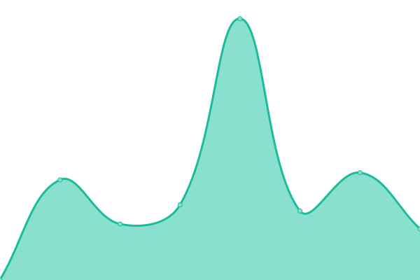

# [📈 Live Status](https://basilesimon.github.io/upptime-monitor): <!--live status--> **🟩 All systems operational**

<!--start: status pages-->
<!-- This summary is generated by Upptime (https://github.com/upptime/upptime) -->
<!-- Do not edit this manually, your changes will be overwritten -->
<!-- prettier-ignore -->
| URL | Status | History | Response Time | Uptime |
| --- | ------ | ------- | ------------- | ------ |
|  [Digital Evidence Toolkit](https://digitalevidencetoolkit.org) | 🟩 Up | [digital-evidence-toolkit.yml](https://github.com/basilesimon/upptime-monitor/commits/HEAD/history/digital-evidence-toolkit.yml) | 

 243ms
     
 | 

<a href="https://basilesimon.github.io/upptime-monitor/history/digital-evidence-toolkit">100.00%</a>
    

|  [Personal website](https://basilesimon.fr) | 🟩 Up | [personal-website.yml](https://github.com/basilesimon/upptime-monitor/commits/HEAD/history/personal-website.yml) | 

 862ms
     
 | 

<a href="https://basilesimon.github.io/upptime-monitor/history/personal-website">100.00%</a>
    

|  [Personal blog](https://blog.basilesimon.fr) | 🟩 Up | [personal-blog.yml](https://github.com/basilesimon/upptime-monitor/commits/HEAD/history/personal-blog.yml) | 

 853ms
     
 | 

<a href="https://basilesimon.github.io/upptime-monitor/history/personal-blog">100.00%</a>
    

|  [Cambodia Corporates](https://cambodiacorporates.globalwitness.org) | 🟩 Up | [cambodia-corporates.yml](https://github.com/basilesimon/upptime-monitor/commits/HEAD/history/cambodia-corporates.yml) | 

 540ms
     
 | 

<a href="https://basilesimon.github.io/upptime-monitor/history/cambodia-corporates">100.00%</a>
    

|  [Great Rip Off Map](https://greatripoffmap.globalwitness.org) | 🟩 Up | [great-rip-off-map.yml](https://github.com/basilesimon/upptime-monitor/commits/HEAD/history/great-rip-off-map.yml) | 

 387ms
     
 | 

<a href="https://basilesimon.github.io/upptime-monitor/history/great-rip-off-map">100.00%</a>
    

|  [Linkurious](https://linkurious.globalwitness.org/login) | 🟩 Up | [linkurious.yml](https://github.com/basilesimon/upptime-monitor/commits/HEAD/history/linkurious.yml) | 

 444ms
     
 | 

<a href="https://basilesimon.github.io/upptime-monitor/history/linkurious">100.00%</a>
    

<!--end: status pages-->

[**Visit our status website →**](https://basilesimon.github.io/upptime-monitor)

## ❓ What is this?

With [Upptime](https://upptime.js.org), you can get your own unlimited and free uptime monitor and status page, powered entirely by a GitHub repository. We use [Issues](https://github.com/basilesimon/upptime-monitor/issues) as incident reports, [Actions](https://github.com/basilesimon/upptime-monitor/actions) as uptime monitors, and [Pages](https://basilesimon.github.io/upptime-monitor) for the status page.

## 📄 License

- Powered by: [Upptime](https://github.com/upptime/upptime)
- Code: [MIT](./LICENSE) © [Basile Simon](https://basilesimon.fr)
- Data in the `./history` directory: [Open Database License](https://opendatacommons.org/licenses/odbl/1-0/)
